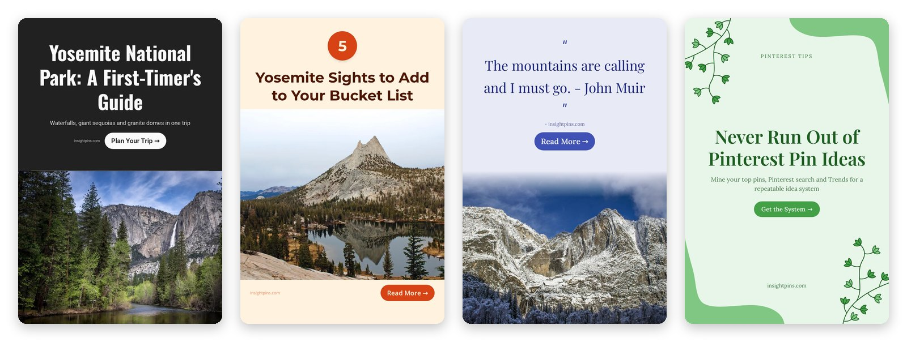
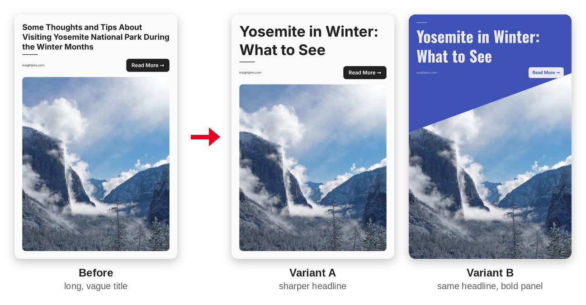

# InsightPins for Claude

**Turn any blog post, product page or recipe into a Pinterest pin that gets noticed and clicked,
in one message.**

Paste a link and Claude does the rest: it reads the page, writes a scroll-stopping headline, picks
a matching template, colors and fonts, renders a finished 1000x1500 pin, checks its own work and
hands you ready-to-paste Pinterest copy. No design tool, no templates to fill in, no API key.



*Example pins made with this plugin. Photos: U.S. National Park Service
(public domain).*

## Why use it

- **From link to finished pin in one message.** Claude reads your page, chooses the best photo
  and writes the text. You just say "make a pin for this".
- **Design rules built in.** The skills carry what works on Pinterest: a headline you can read at
  phone size, one clear focal point, colors that fit the topic, contrast checked for every palette,
  the right template for the content (recipe, product, listicle, quote, travel, how-to).
- **It checks its own work.** Claude looks at every render and the server's warnings (cut-off
  title, heavily cropped or blurry photo, text too small or faded) and fixes real defects before you
  see them.
- **Copy and SEO included.** Every pin comes with a keyword-rich Pinterest title, description, alt
  text and a board suggestion. Facts come only from your page: no invented prices or claims.
- **A designer's eye on pins you already have.** Upload a pin for an honest score and ranked fixes,
  or get improved versions to A/B test.
- **Bulk upload without the rejections.** Build or check a Pinterest bulk upload CSV and catch every
  row Pinterest would refuse before you upload.
- **Free to start.** 38 templates, 15 color palettes, 10 font pairings and 50 renders a day.

## See it in action

### Make a pin from a link

> Make a pin for https://insightpins.com/blog/pinterest-pin-ideas.html

Claude replies with the pin (the green one on the right above) and everything you need to post it
(shortened):

```
Here's your pin: https://pins.insightpins.com/mcp/... (link works for 7 days, download it)
Edit it on InsightPins without using a render: https://app.insightpins.com/?from=mcp...
Template: Vine Corners, palette Forest Calm, font Classic Serif.
Photo: none. The page's only photo is a wide fridge shot, so I used a text-only template.

Pinterest title: Pinterest Pin Ideas: A System for Never Running Out
Description: Stuck for Pinterest pin ideas? Mine your own top pins, Pinterest search and Trends ...
Alt text: Text pin with green vines reading "Never Run Out of Pinterest Pin Ideas"
Suggested board: Pinterest Marketing Tips
```

### Get several pins to test

> Make 4 different pins for https://insightpins.com/blog/pinterest-pin-ideas.html

Each pin changes something that matters (photo, template and headline angle), not just the color,
so you can post fresh pins over several weeks and see which one wins.

### Review a pin

> *(upload a pin)* Why isn't this pin getting clicks?

```
Overall: 5.8/10 - nice photo, but the headline is hard to read in the feed and doesn't promise much.

Top fixes (biggest impact first)
1. Title is long and thin at phone size -> cut it to 3-5 words in a heavy font.
2. "Some thoughts and tips" is vague -> name the payoff: "Yosemite in Winter".
3. White-on-white layout blends into the feed -> add a bold color block behind the title.
```

The review scores 8 criteria (readability, promise, photo, layout, scroll-stopping power, format,
branding, trust) and suggests better headlines. It uses no renders.

### Optimize a pin

> Make this pin better and give me versions to test



*Claude finds what holds the pin back, then makes versions that each test one change. Variant A
keeps the layout and fixes the headline. Variant B keeps A's headline and moves it onto a bold,
high-contrast panel in a color that suits a winter trip. Post both, compare save and click rates
after a few weeks, and you'll know which change worked.*

### Check a bulk upload CSV

> *(upload pins.csv)* Check this before I upload it to Pinterest

```
3 problems in 24 rows:
Row 4: the title is 112 characters, Pinterest allows 100 -> suggested shorter title: ...
Row 7: the media URL is a Google Drive share link, not an image file -> use a direct image link
Row 9: the publish date "3/10/2026 9:00" was rewritten by a spreadsheet app -> tell me your time
       zone and whether that's March 10 or October 3, and I'll convert it to UTC

Want me to rebuild the file with these fixes?
```

## What's inside

There are no agents, hooks or background processes: everything runs in your conversation, and
Claude picks the right skill from what you ask.

**Skills** (Claude uses them on its own; in Claude Code you can also call each one as
`/insightpins:<name>`)

| Skill | What it does |
| - | - |
| `create-pin` | The full workflow from a URL to a finished pin: reads the page, picks the photo, template and style, renders, checks the result and writes the copy. Also makes sets of variations. |
| `pin-design` | Visual best practices: readability at phone size, layout, photo choice, color, fonts and branding. Used to choose a design and to spot defects in a preview. |
| `pin-copy` | Headlines, Pinterest titles, descriptions, alt text, board names and keywords, written for search and clicks. |
| `review-pin` | Scores an uploaded pin on an 8-point rubric and ranks the fixes by impact. Uses no renders. |
| `optimize-pin` | Finds why a pin underperforms (not seen, not saved or not clicked) and makes 2-3 improved versions, each testing one change, with a plan for comparing them. |
| `remake-pin` | Upload a pin you like (yours or one for inspiration) and get a new, original pin in a similar style for your content, with better design and copy. |
| `pinterest-bulk-csv` | Builds and checks Pinterest bulk upload CSV files: title and description length, direct image links, boards, dates in UTC, CSV quoting, the 200-pin limit. Spreads pins across days in your time zone. |

**Commands**

| Command | What it does |
| - | - |
| `/insightpins:pin <url>` | Create one pin for a page |
| `/insightpins:pin-variations <url> [count]` | Create several different pins for one page |

In claude.ai chat and Cowork you don't need commands: just describe what you want.

**InsightPins connector tools** (from the InsightPins server, used by the skills)

| Tool | What it does |
| - | - |
| `extract_url` | Reads a page: title, description, photos with their size and shape, and recipe or product facts (cook time, servings, price) |
| `list_templates` | Lists the 38 pin templates and the fields each one supports |
| `list_styles` | Lists the 15 color palettes and 10 font pairings |
| `render_pin` | Renders a 1000x1500 pin and returns a preview, an image link, an edit link and warnings |
| `get_quota` | Shows how many renders you have left today |

## Setup

1. Install the plugin from the Claude directory.
2. Open the plugin's **Connectors** tab and connect **InsightPins**. You sign in with your Google account (OAuth). No API key is needed.
3. Ask Claude to make a pin.

In Claude Code the connector loads with the plugin; run `/mcp` to sign in. In Cowork, connect the
InsightPins connector on claude.ai first: Cowork uses the claude.ai connector for servers that need
sign-in. Without the connector, the review, copy and bulk CSV skills still work; making pins needs it.

The connector's server is `https://app.insightpins.com/api/mcp`. Its tools and limits are documented at
[app.insightpins.com/mcp](https://app.insightpins.com/mcp).

## Usage limits

Each rendered pin counts against your InsightPins daily render limit (currently 50 free renders per
account per day), which resets at 00:00 UTC.
Claude checks your remaining renders before making several pins and only re-renders when you ask
for a change or the preview has a real defect. Plans with higher limits may be offered on
insightpins.com; see the website for current plans.

## Data handling

This plugin contains instructions (skills and commands), a connector reference, and two Python
scripts in the `pinterest-bulk-csv` skill (`build_csv.py`, `check_csv.py`). Claude runs those scripts
only when you ask it to build or check a bulk upload CSV. They use only Python's standard library,
read and write the CSV and JSON files you work with, and make no network requests: your CSV is not
sent to InsightPins or anywhere else. Nothing else in the plugin runs code.

When you use it, Claude sends the following to the InsightPins server at `app.insightpins.com`
through the connector:

- the page URLs you ask it to turn into pins (the server fetches the page to read its title, description and images)
- the pin text (headline, subtitle, button text, site name) and the image URLs chosen for the pin
- your template, palette, font and text size choices, and template fields such as a price or cook time

The server fetches the page and the images to draw the pin, and doesn't keep the page content.
It never receives your conversation or files you upload to Claude: pins you upload for review or
remakes are read by Claude in the conversation only.

What InsightPins keeps:

- **Your account.** Signing in with Google gives InsightPins your email address, name and Google
  account ID, which identify you. It never sees your Google password and doesn't store your
  profile picture.
- **The connection.** Which app is connected, when, and a hashed copy of its access token. Claude
  never gets your Google sign-in. Unused connections expire after 30 days.
- **Render records.** For each pin: the time, template, colors, font, image format and size, and the
  headline. They count your daily limit and list your recent pins, and stay as long as your account.
- **Rendered images**, for 7 days. Anyone with an image's link can open it, so share links with care.
- **Server logs**, including failed page fetches or renders with your account ID and the URL involved.
The plugin sends no data to any other service. See the InsightPins
[privacy policy](https://insightpins.com/privacy.html) and
[terms of service](https://insightpins.com/terms-of-use.html).

## Support

Email [ruslan@insightpins.com](mailto:ruslan@insightpins.com) or see
[insightpins.com/contacts.html](https://insightpins.com/contacts.html).

## Images and copyright

Pins often use photos from the page you link. Claude always tells you where the photo came from.
Make sure you have the right to publish it, or use your own images or licensed stock photos. When
you upload someone else's pin for inspiration, Claude creates an original design and copy rather
than copying their image or text.

The example pins on this page use photos from the U.S. National Park Service (nps.gov), which are
in the public domain.

## Disclaimer

Pinterest is a trademark of Pinterest, Inc. InsightPins is an independent product and is not
affiliated with, endorsed by or sponsored by Pinterest.

## License

MIT - see [LICENSE](LICENSE).
